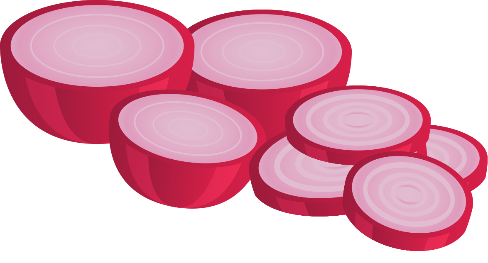

# 🧅 Clean Architecture & Nx workspace

[clean-architecture.design](https://clean-architecture.design)

## Install

```sh
npm i @nx-clean/plugin-core
```

Nx Clean is a plugin for developers that extends Nx, although we have several schematics and plugins already, sometimes we miss one that already creates libraries with functional implementations and obviously, structured following good practices. Thinking about big projects, with many people working and it will remain alive for a long period, it is a fact the architecture becomes essential...

Clean architecture proposes some techniques that solve the problems and reduce the effort in future maintenance, generating less impact on changes. With well-defined layers and little coupling, Nx Clean aims to provide the generation of scaffoldings with some of these best practices already implemented and working, being a framework agnostic. Keep the business rule working safely, without worrying about the hype framework of the moment, use your business rules with ease and practicality where necessary, respecting the defined layers. This can be done using ES Lint.

## Docs

### Generators
  - [Domain](./libs/plugin/core#domain---generate):
  business rules lives here
  - [Data](./libs/plugin/core#data---generate):
  our data access layer
  - [Presentation](./libs/plugin/core#presentation---generate):
  data flow handling

### Packages
  - [Core](./libs/core):
  common abstractions, dependency injector...

---


